# End-to-End Book Recommender System

A production-grade collaborative filtering book recommendation system built with KNN on the Book-Crossing dataset. Features a FastAPI backend, a React (Vite) frontend with model versioning UI, and full experiment tracking via [DagsHub](https://dagshub.com/) + MLflow.

## System Architecture

```mermaid
graph LR
    %% Data Stage
    subgraph Data_Pipeline ["1. Data Pipeline"]
        Raw["Book-Crossing Dataset<br/>(CSV files)"] -->|stage_00_data_ingestion.py| Raw2["Downloaded & Extracted Data"]
        Raw2 -->|stage_01_data_validation.py| Clean["Validated & Cleaned CSVs"]
        Clean -->|stage_02_data_transformation.py| Pivot["Book-User Pivot Table<br/>(Sparse Matrix)"]
    end

    %% Training Stage
    subgraph Training_Pipeline ["2. Model Training"]
        Pivot -->|stage_03_model_training.py| KNN["KNN Model<br/>(Cosine Similarity)"]
        KNN -->|evaluate.py| Metrics["Evaluation Metrics<br/>(Hit@5, NDCG, Precision, Recall)"]
        KNN -->|Serialize| Artifacts["Local Artifacts<br/>(.pkl files)"]
    end

    %% MLflow / DagsHub Tracking
    subgraph MLTracking ["3. Experiment Tracking"]
        Metrics -->|mlflow.log_metrics| DagsHub["DagsHub MLflow Server<br/>(Remote Registry)"]
        Artifacts -->|mlflow.log_artifacts| DagsHub
        DagsHub -->|mlflow.sklearn.log_model| Registry["Model Registry<br/>(Book_Recommender_Model v1, v2 ...)"]
    end

    %% Serving Stage
    subgraph Deployment ["4. Inference & Serving"]
        Registry -->|POST /models/load/version| API["FastAPI Backend<br/>(:8000)"]
        API -->|/recommend| UI["React Dashboard<br/>(:5173)"]
        UI -->|Model Sidebar| Registry
        User["End User"] -->|Interact| UI
    end

    %% Styling
    style Data_Pipeline fill:#e1f5fe,stroke:#01579b
    style Training_Pipeline fill:#fff3e0,stroke:#e65100
    style MLTracking fill:#f3e5f5,stroke:#6a1b9a
    style Deployment fill:#e8f5e9,stroke:#1b5e20
```



## Project Structure

```
book-recommendation-system-new/
├── backend/
│   ├── api.py                  # FastAPI server (training, inference, model versioning endpoints)
│   ├── evaluate.py             # Offline evaluation (Hit@5, NDCG, Precision, Recall)
│   ├── books_recommender/      # Modular ML pipeline package
│   │   ├── components/         # Pipeline stages (0-3)
│   │   │   ├── stage_00_data_ingestion.py
│   │   │   ├── stage_01_data_validation.py
│   │   │   ├── stage_02_data_transformation.py
│   │   │   └── stage_03_model_training.py
│   │   ├── config/
│   │   │   └── configuration.py
│   │   ├── entity/             # Data class definitions
│   │   ├── pipeline/
│   │   │   └── training_pipeline.py
│   │   ├── logger/
│   │   └── exception/
│   ├── config/
│   │   └── config.yaml         # Path configuration
│   ├── artifacts/              # Generated model & data files (local cache)
│   └── logs/
├── frontend/                   # React (Vite) app
│   ├── src/
│   │   ├── App.jsx             # Main UI (Training tab, Inference tab, Model Registry sidebar)
│   │   ├── LogsPage.jsx        # Live log viewer
│   │   └── App.css
│   └── Dockerfile.frontend
├── main.py                     # Run training pipeline directly (CLI)
├── requirements.txt
├── Dockerfile
└── docker-compose.yaml
```

## Pipeline Workflow

`config.yaml` → `entity` → `config/configuration.py` → `components` → `pipeline` → `api.py` → DagsHub/MLflow Registry → `frontend/`

---

## DagsHub + MLflow Integration

This project uses **DagsHub** as a free, cloud-hosted **MLflow Tracking Server** to:

- Track every training run (params, metrics, artifacts)
- Store the entire `artifacts/` folder per experiment run
- Register versioned models in the **Model Registry** (`Book_Recommender_Model v1, v2 ...`)
- Enable rolling back inference to any previous version via the UI sidebar

### Setup DagsHub

1. Create a free account at [dagshub.com](https://dagshub.com)
2. Create a new repository (connect to your GitHub repo)
3. Go to **Remote → Experiments** to get your tracking URI and credentials

### Configure Environment Variables

Create a `.env` file **in the project root** (this is used by both `docker-compose.yaml` and local development):

```env
MLFLOW_TRACKING_URI=https://dagshub.com/<your_username>/<your_repo>.mlflow
MLFLOW_TRACKING_USERNAME=<your_username>
MLFLOW_TRACKING_PASSWORD=<your_token>
DAGSHUB_USER_TOKEN=<your_personal_access_token>
```

> In `api.py`, replace `repo_owner` and `repo_name` in `dagshub.init()` with your values.

### Model Versioning UI

The React sidebar shows all versions from the DagsHub Model Registry:

- **On startup** — metrics of the latest version are shown as a preview (model not loaded)
- **Load Selected Model** — downloads the artifact folder for that version from DagsHub via `/models/load/{version}` and loads it into memory. The warning disappears once loaded.
- **After Training** — the newly trained model is immediately available for inference (no need to reload).

---

## How to Run (Local)

### Step 1 — Clone the repository

```bash
git clone https://github.com/VIVPM/book-recommendation-system-new.git
cd book-recommendation-system-new
```

### Step 2 — Create and activate a conda environment

```bash
conda create -n books python=3.10 -y
conda activate books
```

### Step 3 — Setup environment variables

Create a `.env` file in the project root with your DagsHub credentials (see [Configure Environment Variables](#configure-environment-variables) above). This is required for training and model versioning to work.

### Step 4 — Install Python dependencies

```bash
pip install -r backend/requirements.txt
```

### Step 5 — Run the FastAPI backend

```bash
cd backend

# Fix emoji encoding from dagshub (pick your OS):
$env:PYTHONUTF8="1"             # Windows PowerShell
# export PYTHONUTF8=1           # Linux / Mac

uvicorn api:app --reload --port 8000
```

API available at: `http://localhost:8000`
Swagger docs at: `http://localhost:8000/docs`

### Step 6 — Run the React frontend (new terminal)

```bash
cd frontend
npm install
npm run dev
```

Frontend available at: `http://localhost:5173`

### (Optional) Train the model via CLI

```bash
# From project root
python main.py
```

---

## How to Run (Docker)

### Step 1 — Install Docker and Docker Compose

```bash
sudo apt-get update -y && sudo apt-get upgrade -y

curl -fsSL https://get.docker.com -o get-docker.sh
sudo sh get-docker.sh

sudo usermod -aG docker $USER
newgrp docker
```

### Step 2 — Clone and build

```bash
git clone https://github.com/VIVPM/book-recommendation-system-new.git
cd book-recommendation-system-new

docker-compose up -d --build        # first time (builds images + starts) and whenever git pull is required
# or
docker-compose up -d             # run in background (detached)
```

| Service  | URL                   |
| -------- | --------------------- |
| Backend  | http://localhost:8000 |
| Frontend | http://localhost:5173 |

### Run containers individually (without docker-compose)

**Backend:**

```bash
docker build -t VIVPM/bookapp-backend:latest ./backend
docker run -d -p 8000:8000 VIVPM/bookapp-backend:latest
```

**Frontend:**

```bash
docker build -t VIVPM/bookapp-frontend:latest ./frontend
docker run -d -p 5173:5173 VIVPM/bookapp-frontend:latest
```

### Push images to Docker Hub

Once `image:` fields are set in `docker-compose.yaml`, you can build and push all images in two commands:

```bash
docker login                     # Login to Docker Hub (one time)
docker-compose build             # Builds all images
docker-compose push              # Pushes all images to Docker Hub
```

Anyone with just the `docker-compose.yaml` file can then run:

```bash
docker-compose up -d             # Pulls images from Docker Hub and starts everything
```

### Useful Docker commands

| Command | What it does |
|---|---|
| `docker-compose up -d --build` | Build images + start containers in background (use on first run or after code changes) |
| `docker-compose up -d` | Start containers in background (no rebuild, use when no code changes) |
| `docker-compose down` | Stop and remove all containers |
| `docker-compose build` | Only build images (doesn't start containers) |
| `docker-compose push` | Push all images to Docker Hub |
| `docker ps` | View running containers |
| `docker ps -a` | View all containers (running + stopped/exited) |
| `docker login` | Login to Docker Hub |

---

## AWS EC2 Deployment

### 1. Open Security Group Ports

On your AWS EC2 Console, go to your instance's Security Group and add the following **Inbound Rules** (Custom TCP, Source: Anywhere `0.0.0.0/0`):

- **Port 8000** (For the FastAPI Backend)
- **Port 5173** (For the React Frontend)

### 2. Install Docker & Clone Repository

SSH into your EC2 instance and run:

```bash
sudo apt-get update -y && sudo apt-get upgrade -y

curl -fsSL https://get.docker.com -o get-docker.sh
sudo sh get-docker.sh
sudo usermod -aG docker ubuntu
newgrp docker

git clone https://github.com/VIVPM/book-recommendation-system-new.git
cd book-recommendation-system-new
```

### 3. Setup DagsHub Authentication

The headless Docker instance requires your DagsHub credentials to track MLflow experiments without a browser prompt.
Create a `.env` file in the project root (same format as [Configure Environment Variables](#configure-environment-variables)):

```bash
cat > .env << 'EOF'
MLFLOW_TRACKING_URI=https://dagshub.com/<your_username>/<your_repo>.mlflow
MLFLOW_TRACKING_USERNAME=<your_username>
MLFLOW_TRACKING_PASSWORD=<your_token>
DAGSHUB_USER_TOKEN=<your_personal_access_token>
EOF
```

### 4. Build and Start the Application

To start the application in the background (detached mode):

```bash
# First time setup or after changing code (forces a rebuild)
docker-compose up -d --build

# To start the server normally without rebuilding
docker-compose up -d

# To stop the server
docker-compose down
```

## Model Evaluation

The collaborative filtering model uses **K-Nearest Neighbors (KNN)** with **Cosine Similarity** to overcome the extreme sparsity of the Book-Crossing dataset.

We test the model using **Leave-One-Out Offline Evaluation**. For a random sample of users, we take one book they highly rated (≥7/10), ask the model for 5 recommendations, and check if the model successfully recommends _other_ books that the same user also highly rated.

### Evaluation Results (Top-5 Recommendations)

| Metric            | Score    | Explanation                                                                      |
| ----------------- | -------- | -------------------------------------------------------------------------------- |
| **Hit Ratio @ 5** | `42.07%` | For 42%+ of users, the model guesses at least one of their other favourite books |
| **NDCG @ 5**      | `29.62%` | Measures ranking quality — correct books appear near the top                     |
| **Precision @ 5** | `13.19%` | ~14% of the 5 recommendations are exact user favourites                          |
| **Recall @ 5**    | `6.48%`  | The Top-5 list catches 6%+ of all books a user has ever loved                    |

> **Note:** In recommendation systems with sparse data, true Precision/Recall is often much higher than measured, as users haven't read/rated most of the good recommendations yet — known as the **False Negative problem**.

### API Endpoints

| Method | Endpoint                 | Description                                        |
| ------ | ------------------------ | -------------------------------------------------- |
| `GET`  | `/health`                | Health check, reports if a model is loaded         |
| `GET`  | `/books`                 | Returns all book names for the dropdown            |
| `POST` | `/recommend`             | Returns 5 similar book recommendations             |
| `POST` | `/train`                 | Triggers the full 4-stage training pipeline        |
| `GET`  | `/models`                | Lists all versions from DagsHub Model Registry     |
| `POST` | `/models/load/{version}` | Downloads & loads a specific version for inference |
| `GET`  | `/logs`                  | Displays backend log files to the frontend         |

Run the offline evaluation yourself:

```bash
python backend/evaluate.py
```
